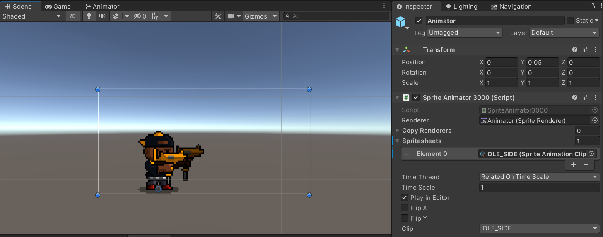

# Spritesheet 3000
Custom pipeline plugin about how to make work together Adobe Photoshop's files with UnityEngine's sprites

  

#### Unity Plugin
The latest version can be installed via package manager using following git URL: \
**https://github.com/am1goo/unity-plugin-spritesheet-3000.git**

## Getting started
#### Photoshop CC Extension
- **Execute install.reg** - don't do anything when change occurs
- **Copy ru.goonswarm.photoshop.extension.spritesheet3000 folder into:** \
	x86 => c:\\Program Files (x86)\\Common Files\\Adobe\\CEP\\extensions\\ \
	x64 => c:\\Program Files\\Common Files\\Adobe\\CEP\\extensions\\
- **Open Photoshop CC and run extension**\
Window -> Extensions -> Spritesheet 3000 Exporter

## Tested in
- **Unity 2019.4.x**
- **Unity 2020.3.x**

## Using in
- **Sin Slayers** - RPG with roguelike elements set in a dark fantasy world, where your choices determine how challenging the fights and enemies will be.

## Contribute
Contribution in any form is very welcome. Bugs, feature requests or feedback can be reported in form of Issues.
