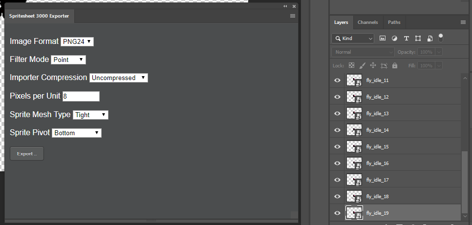
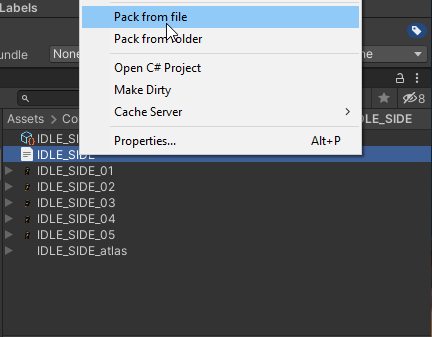

# Spritesheet 3000
Custom pipeline plugin about how to make work together Adobe Photoshop's files with Unity Engine's sprites
<p align="left">
  
</p>

#### Unity Plugin
The latest version can be installed via [package manager](https://docs.unity3d.com/Manual/upm-ui-giturl.html) using following git URL: \
```https://github.com/am1goo/unity-plugin-spritesheet-3000.git```

## Getting started
#### Adobe Photoshop CC Extension
- **Install extentions via Unity Editor menu**\
```Spritesheet 3000 -> Install extensions -> Adobe Photoshop CC```
<p align="left">
  
</p>

or 

- **Install extentions by yourself**\
```Spritesheet 3000 -> Open extensions folder -> Adobe Photoshop CC```

- **Copy folder ```com.am1goo.photoshop.extension.spritesheet3000```**\
into ```C:\Program Files\Common Files\Adobe\CEP\extensions\``` (for Windows x64)\
or\
into ```C:\Program Files (x86)\Common Files\Adobe\CEP\extensions\``` (for Windows x86)

## Format structure
`Adobe Photoshop's extensions` will create some files with ease-to-use structure:
- metafile with source psd filename (heart of this plugin, contains all required meta information about future animation clip - filter type, compression, ppu and etc.)
- bunch of animation frames as single sprites (don't worry about that, these files will be skipped and don't used in runtime-mode at all, needed only in editor-mode purposes)

```
folder|-
      |- metafile
      |- frame_01
      |- frame_02
      |- frame_03
      |- frame_04
      |- ...
      |- frame_xx
```

## How to use
- **Open extension via Adoby Photoshop CC**\
```Window -> Extensions -> Spritesheet 3000 Exporter```

- **Export all frames as single files and generate metadata**\
Set all options and press button ```Export..```
<p align="left">
  
</p>

- **Import frames via single metedata file**\
Open ```Unity Editor```, select single metafile in ```Project``` window, click ```Right Mouse Button``` and select ```Pack from file```
<p align="left">
  
</p>

or

- **Import bunch of frames via folder**\
Open ```Unity Editor```, select whole folder in ```Project``` window, click ```Right Mouse Button``` and select ```Pack from folder```
<p align="left">
  
</p>

- **Use packed frames in your game**\
Put component ```SpriteAnimator3000``` on any game object\
Run any animations via code:
```csharp
using Spritesheet3000;
using UnityEngine;

public class Example : MonoBehaviour
{
    [SerializeField]
    private SpriteAnimationClip3000 _clip;
    [SerializeField]
    private SpriteAnimator3000 _anim;

    private void Awake()
    {
        _anim.Play(_clip);
    }
}
```

## Tested in
- **Unity 2019.4.x**
- **Unity 2020.3.x**

## Using in
- [Sin Slayers](https://www.gog.com/en/game/sin_slayers) - RPG with roguelike elements set in a dark fantasy world, where your choices determine how challenging the fights and enemies will be.

## Contribute
Contribution in any form is very welcome. Bugs, feature requests or feedback can be reported in form of Issues.
